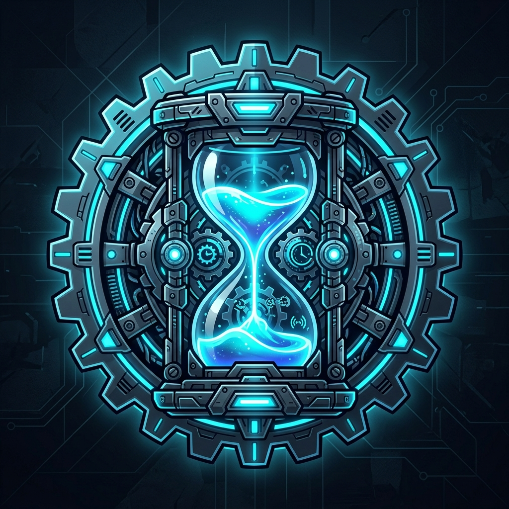
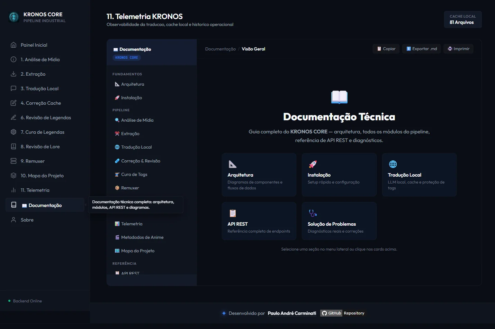

<div align="center">



# KRONOS CORE

### Pipeline Industrial de Processamento & Tradução de Animes
**Tradução de legendas por IA rodando 100% local — sem nuvem, sem custo por token**

---

[](https://openjdk.org/projects/jdk/25/)
[](https://quarkus.io/)
[](https://gradle.org/)
[](https://lmstudio.ai/)
[](https://mkvtoolnix.download/)
[](https://ffmpeg.org/)

[](https://github.com/carmipa/traducao_animes_llm_local_quarkus)
[](https://www.linkedin.com/in/paulo-andr%C3%A9-carminati-47712340/)
[](https://github.com/carmipa?tab=repositories)

</div>

---

## O que é o KRONOS CORE?

O **KRONOS CORE** é uma plataforma de automação para **tradução industrial de legendas de anime**, cobrindo o pipeline completo do fã-sub: da mídia crua ao MKV final remuxado. Ele combina:

- 🔍 **Auditoria técnica de mídia** (ffprobe) com detecção automática de dessincronismo de legenda
- ✂️ **Extração em lote** de faixas de legenda (ASS/SRT/PGS) de MKV/MP4/qualquer contêiner comum
- 🌐 **Tradução por LLM 100% local** (LM Studio) com cache persistente e lore por anime (56+ contextos)
- 🩹 **Três fluxos de correção/revisão** (LLM, Google Translate, heurística de concordância PT-BR)
- 🧵 **Restauração estrutural de tags ASS** corrompidas por alucinação de IA (Aegisub/Kara Templater)
- 📖 **Revisão de Lore** pós-tradução — nomes, locais e termos de mundo validados contra a lore oficial da obra, com trilha de auditoria por fala
- 🔤 **Troca de fontes legadas** — detecta e substitui fontes TCVN3/VNI de fansubs (que corrompem a acentuação PT-BR na renderização) por fontes Unicode
- 📦 **Remuxagem automatizada** com preservação total de qualidade original
- 🧹 **Renomeação em lote de arquivos** — nomes de tracker viram o padrão `Nome - S01E01`, com dry-run e undo
- 📊 **Telemetria em tempo real** (SSE) de todas as etapas do pipeline

Tudo rodando sobre **Java 25 + Quarkus** com uma SPA própria (HTML/CSS/JS puro, sem framework de frontend), pensado para operação **desktop-first e 100% offline** — a única dependência de rede é opcional (metadados de anime via Jikan/TMDB).


---

## Navegação da Documentação

> Clique em qualquer seção para ir à documentação detalhada.

[](docs/01-arquitetura.md)
[](docs/02-instalacao.md)
[](docs/13-api-endpoints.md)
[](docs/14-configuracao.md)
[](docs/15-solucao-problemas.md)

| # | Módulo | Descrição |
|---|--------|-----------|
| 📐 | [**Arquitetura**](docs/01-arquitetura.md) | Visão geral, diagramas de componentes e fluxos de dados |
| 🚀 | [**Instalação & Configuração**](docs/02-instalacao.md) | Pré-requisitos, setup local e primeiros passos |
| 🔍 | [**Análise de Mídia**](docs/03-modulo-analise-midia.md) | Auditoria ffprobe e detecção de dessincronismo de legenda |
| ✂️ | [**Extração de Legendas**](docs/04-modulo-extracao-legendas.md) | Extração em lote ASS/SRT/PGS via MKVToolNix/ffmpeg |
| 🌐 | [**Tradução Local (LLM)**](docs/05-modulo-traducao-llm.md) | Núcleo: LM Studio, cache, proteção de tags, contextos |
| 🩹 | [**Correção & Revisão**](docs/06-modulo-correcao-revisao.md) | Os 3 fluxos: LLM, Google Translate, concordância PT-BR |
| 🧵 | [**Cura de Tags**](docs/07-modulo-cura-tags.md) | Restauração estrutural de tags ASS/Kara Templater |
| 📖 | [**Revisão de Lore**](docs/16-modulo-revisao-lore.md) | Corrige nomes, locais e termos de lore comparando com o original em inglês |
| 🔤 | [**Troca Tipo Legenda**](docs/18-modulo-troca-tipo-legenda.md) | Auditoria e troca em lote de fontes legadas (TCVN3/VNI) por fontes Unicode |
| 📦 | [**Remuxer**](docs/08-modulo-remuxer.md) | Combina vídeo + legenda em MKV final |
| 🧹 | [**Renomear Arquivos**](docs/19-modulo-renomear-arquivos.md) | Renomeação em lote para o padrão `Nome - S01E01`, com dry-run e undo |
| 🎭 | [**Contextos & Lore**](docs/09-contextos-lore.md) | Sistema de lore por anime — 56+ contextos cadastrados |
| 📊 | [**Telemetria**](docs/10-modulo-telemetria.md) | Rastreamento de operações e métricas de JVM em tempo real |
| 🎬 | [**Metadados de Anime**](docs/11-modulo-metadados-anime.md) | Integração Jikan/MAL e TMDB para pôster/sinopse na UI |
| 🗺️ | [**Mapa do Projeto**](docs/12-modulo-mapa-projeto.md) | Gerador automático do índice de código-fonte |
| 📋 | [**API REST — Referência**](docs/13-api-endpoints.md) | Todos os endpoints documentados com exemplos |
| ⚙️ | [**Configuração**](docs/14-configuracao.md) | Referência completa de `application.yml` |
| 🩺 | [**Solução de Problemas**](docs/15-solucao-problemas.md) | Diagnósticos reais: dessincronismo, LM Studio, SSE |
| 🧠 | [**Memória de Decisões da IA**](docs/17-memoria-decisoes-ia.md) | Registro das decisões de engenharia tomadas com assistência de IA |

> A mesma navegação está disponível **dentro da aplicação**, no menu **📖 Documentação** da interface web.

---

## Início Rápido

### Pré-requisitos

| Ferramenta | Versão mínima |
|------------|---------------|
| Java (JDK) | 25 |
| Gradle | Incluído via Wrapper |
| FFmpeg / FFprobe | Qualquer build recente |
| MKVToolNix | Qualquer build recente |
| LM Studio | Com servidor local ativo |

### Executar em modo desenvolvimento

```shell
git clone <url-do-repositorio>
cd traducao_animes_llm_local_quarkus

./gradlew quarkusDev
```

> O servidor sobe em **`http://127.0.0.1:8080`** e o navegador abre automaticamente. Detalhes completos em [Instalação & Configuração](docs/02-instalacao.md).

---

## Arquitetura em 30 Segundos

```
┌──────────────────────────────────────────────────────────────────────┐
│                           KRONOS CORE                                 │
│                                                                        │
│  ┌──────────┐    ┌────────────────┐    ┌───────────────────────┐    │
│  │   SPA    │───▶│ ApiController  │───▶│  Use Cases (17 pacotes)│    │
│  │ (HTML/JS)│    │  REST + SSE    │    │  análise → extração →  │    │
│  └──────────┘    └───────┬────────┘    │  tradução → correção → │    │
│                          │              │  cura → remuxer        │    │
│              ┌───────────┼───────────┐  └───────────────────────┘    │
│              ▼           ▼           ▼                                │
│       ┌──────────┐ ┌──────────┐ ┌──────────┐                        │
│       │LM Studio │ │MKVToolNix│ │  FFmpeg  │                        │
│       │ (GPU/LOC)│ │ (remux)  │ │(análise) │                        │
│       └──────────┘ └──────────┘ └──────────┘                        │
└──────────────────────────────────────────────────────────────────────┘
```

> Diagrama completo com fluxo de dados e decisões de arquitetura em [docs/01-arquitetura.md](docs/01-arquitetura.md).

---

## Pipeline de Trabalho

```mermaid
graph LR
    A["📼 Vídeo"] --> B["🔍 Análise"]
    B --> C["✂️ Extração"]
    C --> D["🌐 Tradução"]
    D --> E["🩹 Correção/Revisão"]
    E --> F["🧵 Cura de Tags"]
    F --> F2["📖 Revisão de Lore"]
    F2 --> F3["🔤 Troca de Fonte"]
    F3 --> G["📦 Remuxer"]
    G --> H["🎬 MKV Final"]
    H -.-> I["🧹 Limpa Nome"]
```



Cada etapa é **independente e re-executável** — rode só a etapa que precisar, sem repetir o pipeline inteiro. Detalhes em [Arquitetura — Pipeline Completo](docs/01-arquitetura.md#diagrama-de-fluxo--pipeline-completo-visão-de-negócio).

---

## Stack Tecnológica

```
Backend:    Java 25 + Quarkus 3.37 (compatibilidade Spring: DI, Web, Config)
Frontend:   HTML/CSS/JS puro (SPA sem build step), Server-Sent Events (SSE)
IA:         LM Studio (OpenAI-compatible local), qualquer modelo GGUF servido nele
Mídia:      FFmpeg/FFprobe (análise), MKVToolNix (extração + remux)
Metadados:  Jikan (MyAnimeList) + TMDB (opcional, com chave de API)
Build:      Gradle com Quarkus Plugin
```

---

## Estrutura do Projeto

```
traducao_animes_llm_local_quarkus/
├── src/
│   ├── main/
│   │   ├── java/org/traducao/projeto/
│   │   │   ├── analisadorMidia/       ← Auditoria ffprobe
│   │   │   ├── legendasExtracao/      ← Extração ASS/SRT/PGS
│   │   │   ├── traducao/              ← Núcleo: LLM, cache, contextos, ApiController
│   │   │   ├── raspagemCorrecao/      ← Correção via Google Translate
│   │   │   ├── raspagemRevisao/       ← Revisão de concordância PT-BR
│   │   │   ├── correcaoLegendas/      ← Correção estrutural (original como referência)
│   │   │   ├── revisaoLore/           ← Revisão de nomes/termos vs. lore oficial
│   │   │   ├── trocaTipoLegenda/      ← Troca de fontes legadas por Unicode
│   │   │   ├── remuxer/               ← Combina vídeo + legenda
│   │   │   ├── renomearArquivos/      ← Renomeação em lote (S01E01) com undo
│   │   │   ├── sistema/               ← Encerramento gracioso (menu "Sair")
│   │   │   ├── telemetria/            ← Rastreamento de operações
│   │   │   ├── mapaProjeto/           ← Gerador de mapa_projeto.md
│   │   │   ├── apiDadosAnime/         ← Metadados (Jikan/TMDB)
│   │   │   └── core/, config/         ← Utilitários, FilaExecucaoPipeline e bootstrap
│   │   └── resources/
│   │       ├── static/                ← SPA (HTML/CSS/JS por painel)
│   │       ├── application.yml        ← Configuração principal
│   │       └── application-local.yml  ← Chaves privadas (git-ignored)
│   └── test/
├── docs/                               ← Esta documentação
├── build.gradle
└── gradle.properties
```

---

## Navegação Interna (dentro do app)

A barra lateral organiza os painéis em **5 grupos acordeão** (recolhíveis, com estado lembrado entre visitas), espelhando a ordem do pipeline:

| Grupo | Painéis |
|-------|---------|
| 🎬 **Preparação** | `1. Análise de Mídia` · `2. Extração` |
| 🌐 **Tradução** | `3. Tradução Local` · `4. Correção Cache` |
| ✅ **Qualidade** | `5. Análise de Conteúdo` · `6. Revisão de Legendas` · `7. Correção de Karaoke` · `8. Revisão de Lore` · `9. Troca Tipo Legenda` |
| 📦 **Finalização** | `10. Remuxer` · `11. Renomear Arquivos` |
| ⚙️ **Sistema** | `Telemetria` · `Mapa do Projeto` · **`Documentação`** · `Sobre` |

O menu **Documentação** renderiza esta mesma pasta `docs/` dentro da própria aplicação (incluindo os diagramas Mermaid), sem precisar sair do app ou abrir o GitHub.



---

<div align="center">

**[⬆ Voltar ao topo](#kronos-core)**

[](https://openjdk.org/)
[](https://quarkus.io/)
[](https://lmstudio.ai/)

</div>
