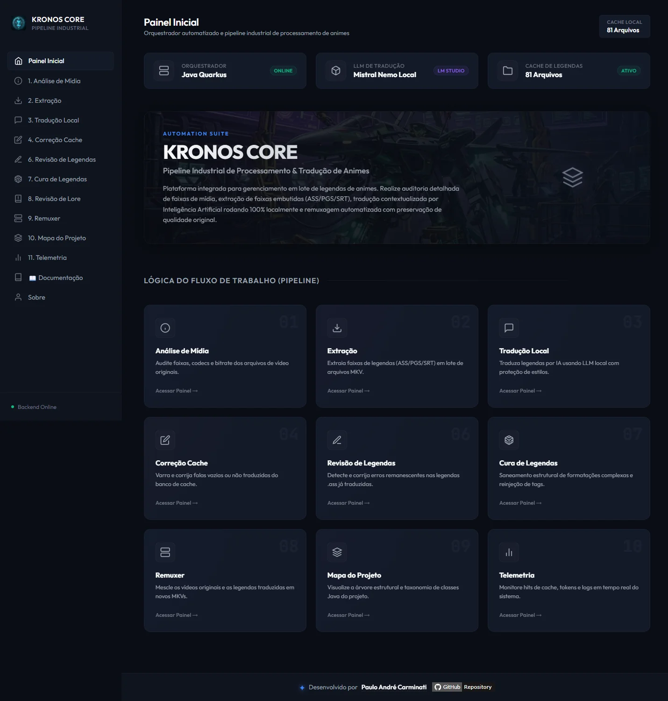
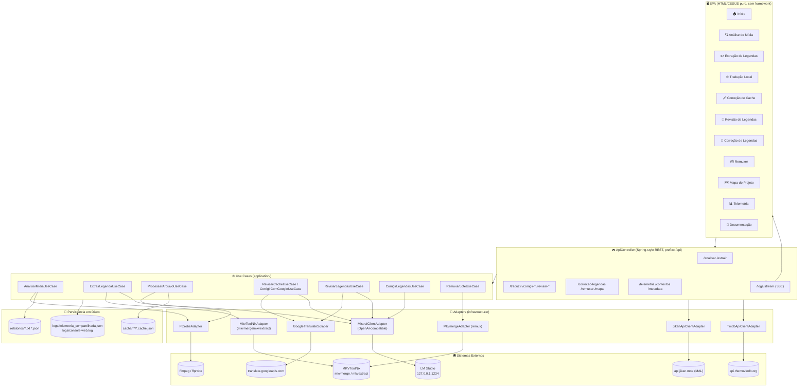
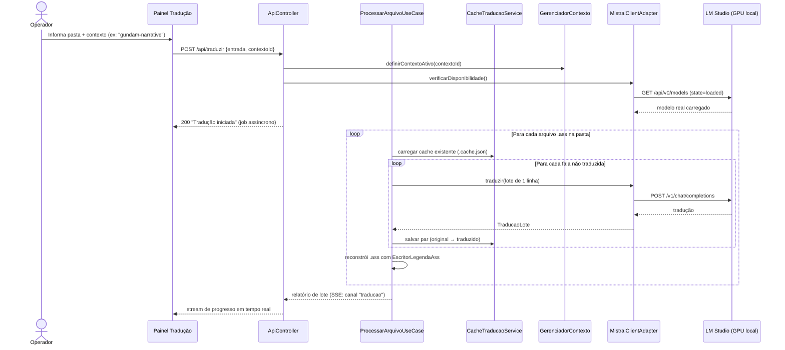

# 📐 Arquitetura do Sistema

[← Voltar ao README](../README.md) | [Instalação & Configuração →](02-instalacao.md)

---

## Visão Geral

O **KRONOS CORE** é uma plataforma monolítica modular construída sobre o **Quarkus** (usando as extensões de compatibilidade Spring — `quarkus-spring-di`, `quarkus-spring-web`, `quarkus-spring-boot-properties`), organizada em **13 pacotes verticais** sob `org.traducao.projeto.*`, cada um resolvendo uma etapa específica do pipeline de tradução de legendas de anime.

O desenho segue **Arquitetura Hexagonal (Ports & Adapters)** por módulo: cada pacote tem, tipicamente, `domain/` (modelos e portas), `application/` (casos de uso, orquestração), `infrastructure/` (adapters concretos — ffmpeg, mkvmerge, HTTP client do LM Studio, scraping do Google Translate) e `presentation/` (controllers REST e/ou CLI).

| Camada | Responsabilidade | Exemplos |
|--------|-------------------|----------|
| `presentation/` | Controllers REST (Spring-style) e telas CLI legadas | `ApiController`, `AnalisadorMidiaCLI` |
| `application/` | Casos de uso — orquestram domínio e adapters | `ProcessarArquivoUseCase`, `ExtrairLegendaUseCase` |
| `domain/` | Modelos, portas (interfaces), exceções de negócio | `MistralPort`, `AuditoriaResultado`, `LegendaInfo` |
| `infrastructure/` | Implementações concretas das portas | `MistralClientAdapter`, `MkvmergeAdapter`, `FfprobeAdapter` |

A aplicação roda **100% localmente** (`quarkus.http.host=127.0.0.1`) — não expõe nenhuma porta na rede, e a única dependência de rede externa opcional é para metadados de anime (Jikan/TMDB) e correção via Google Translate (scraping da API pública, não a API paga).



---

## Diagrama de Componentes



---

## Diagrama de Fluxo — Pipeline Completo (visão de negócio)

```mermaid
graph LR
    A["📼 Vídeo Original<br/>.mkv/.mp4"] --> B["🔍 1. Análise de Mídia<br/>ffprobe: codecs, drift de sync"]
    B --> C["✂️ 2. Extração de Legenda<br/>ASS / SRT / PGS"]
    C --> D["🌐 3. Tradução Local<br/>LLM via LM Studio + cache"]
    D --> E{"Resíduo em<br/>inglês?"}
    E -->|Sim| F["🩹 4. Correção<br/>(cache LLM / Google scraping)"]
    E -->|Não| G["📝 5. Revisão<br/>concordância PT-BR"]
    F --> G
    G --> H["🧵 6. Correção de Legendas<br/>original como referência imutável"]
    H --> I["📦 7. Remuxer<br/>mkvmerge: vídeo + legenda PT-BR"]
    I --> J["🎬 MKV Final<br/>pronto para distribuição"]

    style A fill:#1e293b,stroke:#3B82F6
    style J fill:#1e293b,stroke:#10B981
```



> Cada etapa é **independente e re-executável** — o operador pode rodar só a extração de novo, ou só a revisão, sem repetir as etapas anteriores. O elo entre etapas é sempre o sistema de arquivos (pastas de entrada/saída informadas manualmente em cada painel).

---

## Diagrama de Sequência — Tradução com Cache e LLM Local



---

## Pacotes e Responsabilidades

```
org.traducao.projeto/
├── analisadorMidia/       ← Auditoria técnica (ffprobe): codecs, drift de sincronismo
├── legendasExtracao/      ← Extração de faixas de legenda (ASS/SRT/PGS) via mkvextract/ffmpeg
├── traducao/               ← Núcleo: tradução LLM, cache, contextos/lore, HTTP client LM Studio
│   ├── contexto/           ← 56+ providers de lore por anime/temporada
│   ├── infrastructure/     ← MistralClientAdapter, CacheTraducaoService, http/, config/
│   └── presentation/web/   ← ApiController (a maioria dos endpoints REST vive aqui)
├── raspagemCorrecao/       ← Correção de cache via Google Translate (scraping)
├── raspagemRevisao/        ← Revisão de legendas .ass finais (Google ou LLM) + detector de concordância PT-BR
├── revisaoLore/             ← Refinamento de lore pós-tradução: nomes, lugares, objetos e termos de universo
├── correcaoLegendas/        ← Correção estrutural da legenda PT-BR usando a original como referência imutável
├── remuxer/                 ← Combina vídeo original + legenda traduzida em MKV final (mkvmerge)
├── telemetria/               ← Rastreamento de operações, métricas JVM, SSE de telemetria
├── mapaProjeto/               ← Gera o mapa_projeto.md (varredura estática de docstrings)
├── apiDadosAnime/              ← Metadados externos (Jikan/MAL, TMDB) — decorativo na UI
├── traducaoCorrige/             ← LimparCacheUseCase (esvazia entradas de fallback do cache)
├── core/                          ← Utilitários e exceções compartilhadas (ProcessoExternoUtil, BasePipelineException)
└── config/                         ← Bootstrap (modo WEB vs CLI legado)
```

---

## Decisões de Arquitetura

### Por que Quarkus com compatibilidade Spring, e não Quarkus "puro" (JAX-RS/CDI nativo)?

O projeto foi originalmente escrito sobre Spring Boot e migrado para Quarkus preservando as anotações `@RestController`, `@Component`, `@Service`, `@RequestMapping` via `quarkus-spring-web` e `quarkus-spring-di`. Isso permitiu ganhar o **modo dev com live reload** e o tempo de boot menor do Quarkus sem reescrever toda a camada web. Pontos onde SSE/JAX-RS puro é necessário (`LogStreamResource`, `TelemetriaStreamResource`) usam `@Path`/`@GET` nativos do Quarkus para evitar colisão de roteamento com o dispatcher Spring-style.

### Por que LLM local (LM Studio) em vez de API paga?

Tradução de legendas de fã-sub envolve volumes grandes de texto (temporadas inteiras, filmes) e a lore de cada obra é sensível a nuance (nomes próprios, gênero de personagens, tom). Rodar localmente via LM Studio elimina custo por token, elimina limite de rate, e garante que o app **adapta-se dinamicamente ao modelo que o operador tiver carregado** (ver [`tradutor.llm.model: "current"`](14-configuracao.md)) — o operador troca de modelo pela UI do LM Studio para comparar qualidade sem precisar recompilar o app.

### Por que cache em JSON por arquivo, e não banco de dados?

O cache (`cache/**/*.cache.json`) espelha a estrutura de pastas de entrada do usuário, é editável manualmente (o operador pode corrigir uma tradução direto no JSON), e não introduz dependência de infraestrutura (sem SGBD para rodar/manter). O trade-off é que buscas cruzadas entre animes não são triviais — mitigado pelo fato de que cada operação já é escopada a uma pasta específica.

### Por que 3 fluxos distintos de correção/revisão em vez de um só?

Cada fluxo ataca uma fonte de erro diferente com o custo/precisão adequado: **correção de cache** (LLM local, grátis, mas pode repetir o mesmo erro do 1º passe), **correção via Google Translate** (scraping gratuito, baseline melhor que "não traduzido", mas sem entender a lore), e **revisão de concordância PT-BR** (heurística regex + LLM, focada especificamente no problema mais comum de tradução EN→PT-BR: calque de gênero). Ver [Correção & Revisão](06-modulo-correcao-revisao.md) para o comparativo completo.

### Por que SSE (Server-Sent Events) para logs em vez de WebSocket?

Todo o fluxo de logs é **unidirecional** (servidor → navegador) — o operador só observa o progresso, nunca envia comandos pelo canal de log. SSE é mais simples de implementar (HTTP puro, sem handshake de upgrade), reconecta automaticamente no navegador (`EventSource`), e o `ConsoleRedirector` intercepta `System.out` globalmente, então qualquer `println` de qualquer módulo já aparece no navegador sem instrumentação extra.

---

## Navegação

| Anterior | Próximo |
|----------|---------|
| [← README](../README.md) | [Instalação & Configuração →](02-instalacao.md) |
