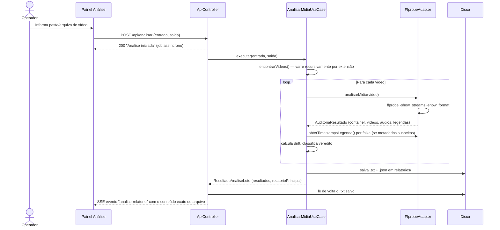
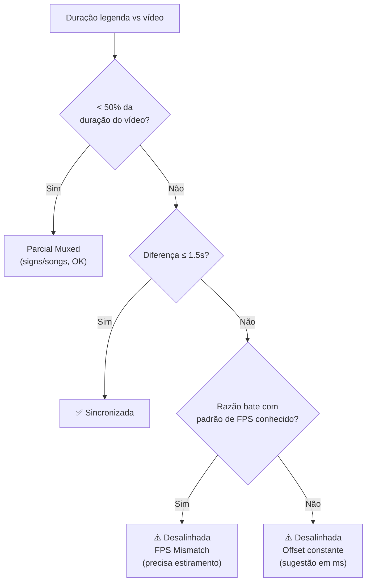

# 🔍 Módulo: Análise de Mídia

[← Instalação](02-instalacao.md) | [Extração de Legendas →](04-modulo-extracao-legendas.md)

---

## Para que serve

Primeira etapa do pipeline: **auditoria técnica** de arquivos de vídeo antes de qualquer processamento. Usa `ffprobe` para extrair contêiner, codecs de vídeo/áudio, e **cada faixa de legenda embutida**, calculando um **veredito de sincronismo** por faixa — a funcionalidade mais importante do módulo, porque detecta legendas dessincronizadas *antes* de gastar tempo traduzindo um arquivo com problema na fonte.

> 📖 Contexto real de uso desta funcionalidade: numa sessão de suporte, este módulo foi usado para diagnosticar por que a legenda de um filme (*Gundam Narrative*) chegava "adiantada" desde a primeira fala — a causa raiz era a legenda ter sido extraída de um release/encode diferente (grupo de fansub distinto) do vídeo usado no remux final. Ver [Solução de Problemas](15-solucao-problemas.md#legenda-dessincronizada-desde-o-inicio).

---

## Pacote e classes principais

| Classe | Papel |
|--------|-------|
| `AnalisarMidiaUseCase` (`application`) | Orquestra o lote: varre vídeos, chama o adapter, monta o relatório de texto, salva em disco e registra telemetria |
| `FfprobeAdapter` (`infrastructure/adapters`) | Executa `ffprobe -show_format -show_streams -print_format json` e mapeia o JSON para os records de domínio |
| `AuditoriaResultado`, `ContainerInfo`, `VideoInfo`, `AudioInfo`, `LegendaInfo` (`domain`) | Records imutáveis do resultado da auditoria |
| `ResultadoAnaliseLote` (`domain`) | Retorno do use case: lista de resultados + `Path` do relatório `.txt` efetivamente salvo em disco |
| `ConsoleAnalisadorLogger` (`presentation/ui`) | Formatação colorida para a CLI legada |

---

## Fluxo de execução



> O relatório exibido na tela **é o mesmo arquivo `.txt` gravado em disco**, lido de volta e transmitido via SSE — não uma reconstrução em memória. Isso garante que a tela sempre mostra exatamente o que foi persistido (fonte única de verdade).

---

## O que é auditado por faixa

### Vídeo
Codec, resolução, profundidade de cor, FPS, aspect ratio, bitrate.

### Áudio
Idioma, codec, canais, taxa de amostragem, bitrate, título da faixa.

### Legenda — a parte crítica: veredito de sincronismo

Para cada faixa de legenda, o módulo compara a **duração do vídeo** com a **duração real da legenda** (obtida via análise de pacotes do ffprobe quando os metadados são suspeitos — ex.: duração igual à do vídeo, que é um placeholder comum, não um valor real) e classifica:

| Veredito | Condição | Interpretação |
|----------|----------|----------------|
| **Legenda Parcial Muxed** | Duração da legenda < 50% da duração do vídeo | Normal para faixas de "signs/songs" — não precisa de sync global |
| **Legenda Sincronizada!** | Diferença de fim ≤ 1.5s | Dentro da margem seguraç, nenhuma ação necessária |
| **Desalinhada — FPS Mismatch** | Razão vídeo/legenda bate com um dos padrões conhecidos (25→23.976, 23.976→25, 24→23.976, 23.976→24) | A legenda foi timada para outro frame rate — precisa de **estiramento de tempo**, não só um offset fixo |
| **Desalinhada — atraso constante** | Diferença de fim > 1.5s, sem padrão de FPS | Sugestão de **offset em ms** a aplicar (calculado automaticamente) no [Remuxer](08-modulo-remuxer.md) |



---

## Formato de legenda detectado (resumo no topo do relatório)

O relatório sempre abre com uma seção **"FORMATO DE LEGENDA DETECTADO"**, listando o tipo de cada faixa (ASS, SRT, PGS, VobSub, DVB, WebVTT, MOV_TEXT, hardsub) antes de qualquer outro dado — informação que costuma ser a primeira coisa que o operador precisa saber ao decidir se vale a pena extrair aquele arquivo (ex.: legendas **PGS/VobSub são bitmap**, não extraíveis para texto sem OCR).

---

## Endpoint REST

### `POST /api/analisar`

```json
{
  "entrada": "C:/animes/[Sokudo] DanMachi/Season 04",
  "saida": "C:/animes/[Sokudo] DanMachi/relatorios"
}
```

`saida` é opcional — se omitido, os relatórios vão para uma subpasta `relatorios/` dentro de `entrada`.

**Resposta imediata:** `200 OK` com mensagem de job iniciado. O progresso e o relatório final chegam via **SSE** no canal `analise` (ver [API REST — Referência](13-api-endpoints.md#sse-logsstream)).

**Saída em disco:**
- 1 arquivo de vídeo → `relatorios/<nome>_<timestamp>.txt` + `.json`
- Vários arquivos → `relatorios/consolidado_<pasta>_<timestamp>.txt` (todos concatenados) + um `.json` individual por vídeo

---

## Navegação

| Anterior | Próximo |
|----------|---------|
| [← Instalação](02-instalacao.md) | [Extração de Legendas →](04-modulo-extracao-legendas.md) |
