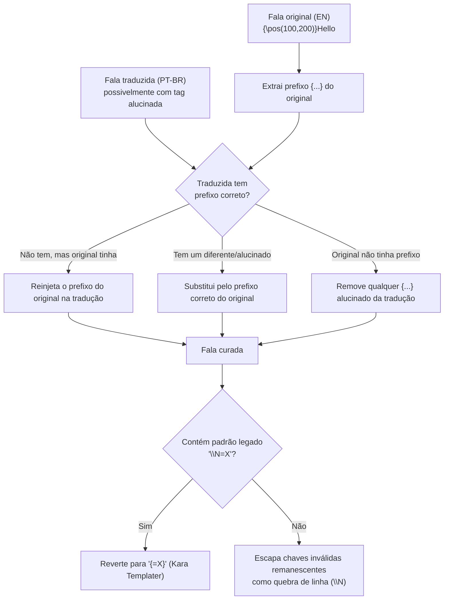

# 🧵 Módulo: Cura de Tags (Aegisub / Kara Templater)

[← Correção & Revisão](06-modulo-correcao-revisao.md) | [Remuxer →](08-modulo-remuxer.md)

---

## Para que serve

Falas de karaokê/efeitos em `.ass` carregam tags de formatação e posicionamento complexas no prefixo (`{\pos(...)\an8\c&H...&}`), e algumas usam a sintaxe especial do **Kara Templater do Aegisub** (`{=1}`, `{=2}`...) para templates de karaokê animado. LLMs frequentemente **alucinam** essas tags durante a tradução — corrompem `{=1}` para `\N=1`, injetam chaves `{texto}` fantasmas que quebram a leitura no Aegisub, ou perdem o prefixo de formatação inteiro. O CuraTags é um **pós-processamento estrutural** que restaura essas tags comparando a legenda original (EN) com a já traduzida (PT-BR), sem precisar retraduzir nada.

---

## Pacote e classes principais

| Classe | Papel |
|--------|-------|
| `CuraTagsUseCase` (`curatags`) | Orquestra: localiza pares original↔traduzido, valida contagem de eventos, aplica sanitização e (opcionalmente) correção LLM |
| `SanitizadorTagsService` | **100% regex/estrutural, sem LLM** — o coração da cura |
| `CorretorTraducaoLlmService` | Camada opcional (só roda se um `contextoId` for informado) — corrige via LLM as falas que *ainda* têm resíduo em inglês depois da cura estrutural |
| `ResultadoCuraTags` | Record de retorno: `curados, corrigidosLlm, semAlteracao, semPar, totalErros, erros` |

---

## O que a sanitização estrutural faz



Regras específicas implementadas:

1. **Prefixo forçado igual ao original** — a tradução é obrigada a usar exatamente o mesmo prefixo `{...}` do início da linha original, inclusive quando o original **não tem** nenhum (nesse caso, qualquer `{...}` que apareça na tradução é considerado alucinação do LLM e é descartado).
2. **`\N=X` → `{=X}`** — reverte um padrão de corrupção legado onde a tag do Kara Templater `{=X}` foi corrompida para uma quebra de linha seguida de `=X`.
3. **Chaves órfãs → quebra de linha** — chaves remanescentes que não formam uma tag ASS válida são alucinação do LLM; em vez de apagar o texto dentro delas (risco de perder conteúdo real), são escapadas como `\N`.

---

## Validação de segurança antes de curar

`CuraTagsUseCase` **recusa** processar um par de arquivos se a contagem de eventos (`Dialogue:`/`Comment:`) do original e do traduzido não bater exatamente — nesse caso, o arquivo é pulado com aviso em vez de arriscar desalinhar falas ao comparar por índice. Isso protege contra o cenário onde o arquivo traduzido já está com linhas fora de ordem por algum outro motivo.

---

## Correção LLM opcional (segunda camada)

Só é acionada quando um `contextoId` é passado no request. Depois da cura estrutural, `CorretorTraducaoLlmService` usa `ValidadorTraducaoService` para detectar se a fala **ainda** tem resíduo em inglês ou alucinação — se sim, mascara as tags (via `MascaradorTags`, mesmo mecanismo da [tradução principal](05-modulo-traducao-llm.md)) e chama `MistralPort.corrigirTraducao()` para re-traduzir só aquela linha específica, preservando o resto do arquivo intacto.

> Resumo do fluxo: **a cura é sempre estrutural** (rápida, determinística, sem custo de LLM); a correção via LLM é um extra opcional só para as falas que restarem com problema textual depois da cura.

---

## Endpoint REST

### `POST /api/cura-tags`

```json
{
  "diretorioOriginal": "C:/animes/[Sokudo] DanMachi/legendas_extraidas",
  "diretorioTraduzido": "C:/animes/[Sokudo] DanMachi/legendas-ptbr",
  "contextoId": "danmachi-s4"
}
```

| Campo | Obrigatório | Descrição |
|-------|:-----------:|-----------|
| `diretorioOriginal` | ✅ | Pasta com as legendas `.ass` originais em inglês |
| `diretorioTraduzido` | ✅ | Pasta com as legendas `.ass` já traduzidas (sufixo `_PT-BR.ass`/`_PTBR.ass`) |
| `contextoId` | ⚪ | Se informado, ativa a segunda camada de correção via LLM |

**Resposta:** mensagem com a contagem de `curados`, `corrigidosLlm`, `semAlteracao`, `semPar` e `totalErros`.

---

## Navegação

| Anterior | Próximo |
|----------|---------|
| [← Correção & Revisão](06-modulo-correcao-revisao.md) | [Remuxer →](08-modulo-remuxer.md) |
