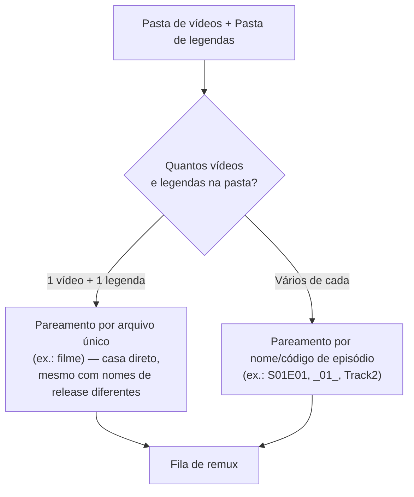
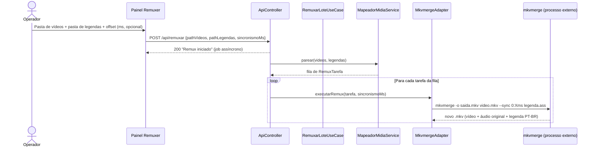

# 📦 Módulo: Remuxer

[← Cura de Tags](07-modulo-cura-tags.md) | [Contextos & Lore →](09-contextos-lore.md)

---

## Para que serve

Última etapa do pipeline: combina o **vídeo original** com a **legenda traduzida** (já revisada/curada) num novo arquivo `.mkv`, via `mkvmerge` (MKVToolNix), preservando todas as faixas de vídeo/áudio originais e adicionando a faixa de legenda PT-BR — sem re-encodar nada (remuxagem, não transcodificação: rápido e sem perda de qualidade).

---

## Pacote e classes principais

| Classe | Papel |
|--------|-------|
| `RemuxarLoteUseCase` (`application`) | Orquestra a fila de tarefas de remux do lote |
| `MapeadorMidiaService` | Pareia cada vídeo com sua legenda correspondente na pasta |
| `MkvmergeAdapter` (`infrastructure/adapters`) | Monta e executa o comando `mkvmerge` |

---

## Pareamento vídeo ↔ legenda



> ⚠️ **Ponto de atenção conhecido:** o fallback "1 vídeo + 1 legenda na pasta" pareia os dois **sem checar se vêm do mesmo release** — se a pasta tiver, por engano, um vídeo de uma fonte (ex.: encode AV1 de um grupo) e uma legenda extraída de outra fonte completamente diferente (ex.: BDRip AMZN de outro grupo), o pareamento "por arquivo único" ainda os casa, e o resultado final fica objetivamente dessincronizado — **não por bug de cálculo de tempo, mas por combinar fontes diferentes**. Sempre confira o [relatório de Análise de Mídia](03-modulo-analise-midia.md) do vídeo final antes de considerar o remux definitivo. Ver [Solução de Problemas](15-solucao-problemas.md#legenda-dessincronizada-desde-o-inicio) para o caso real que motivou este aviso.

---

## Sincronismo manual (offset)

O formulário do Remuxer aceita um campo opcional de **sincronismo manual em milissegundos**:

- Positivo → **atrasa** a legenda
- Negativo → **adianta** a legenda

Esse valor é passado como `--sync 0:<ms>` ao `mkvmerge`, que desloca **linearmente todos os timestamps** da faixa de legenda pelo valor informado.

> ⚠️ O offset é aplicado **igualmente a todos os itens da fila do lote** — não é por arquivo individual. Se o valor foi calculado/ajustado para um episódio específico e a mesma execução processa um lote com outros arquivos (ou um filme com timing diferente), todos recebem o mesmo deslocamento. Confira o campo antes de cada execução, especialmente ao misturar um filme com uma leva de episódios na mesma operação.

O [relatório de Análise de Mídia](03-modulo-analise-midia.md#o-que-é-auditado-por-faixa) já sugere o valor de offset em ms quando detecta um "atraso constante" — use esse número como ponto de partida.

---

## Fluxo de execução



---

## Endpoint REST

### `POST /api/remuxar`

```json
{
  "pathVideos": "C:/animes/Gundam-Narrative-NT",
  "pathLegendas": "C:/animes/Gundam-Narrative-NT/legendas-ptbr",
  "sincronismoMs": 0
}
```

| Campo | Obrigatório | Descrição |
|-------|:-----------:|-----------|
| `pathVideos` | ✅ | Pasta com os vídeos originais |
| `pathLegendas` | ✅ | Pasta com as legendas traduzidas finais |
| `sincronismoMs` | ⚪ | Offset em ms aplicado a **todo o lote** (positivo atrasa, negativo adianta) |

**Saída:** novos `.mkv` gravados na pasta configurada de saída do remux (padrão `mkv_final_ptbr/` dentro da pasta de vídeos).

---

## Navegação

| Anterior | Próximo |
|----------|---------|
| [← Cura de Tags](07-modulo-cura-tags.md) | [Contextos & Lore →](09-contextos-lore.md) |
