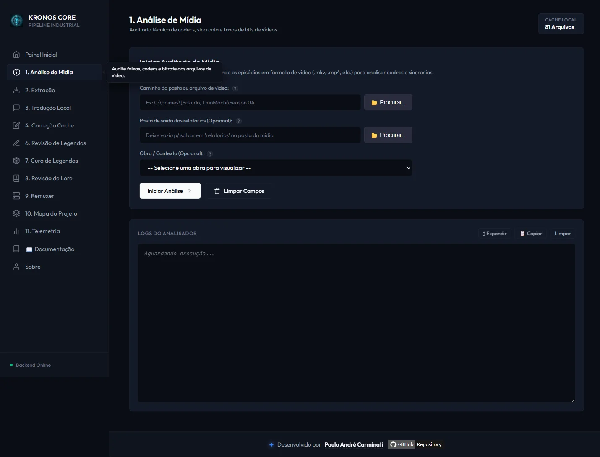

# 📋 API REST — Referência Completa

[← Mapa do Projeto](12-modulo-mapa-projeto.md) | [Configuração →](14-configuracao.md)

---

## Convenções

- **Base URL:** `http://127.0.0.1:8080`
- **Content-Type:** `application/json` em todas as requisições e respostas
- A maioria das operações do pipeline (`/analisar`, `/extrair`, `/traduzir`, `/corrigir-*`, `/revisar-*`, `/remuxar`) é **assíncrona**: o endpoint responde `200 OK` imediatamente com uma mensagem de confirmação, e o progresso/relatório real chega via **[SSE](#sse--logsstream)** no canal correspondente.
- Erros de validação de entrada retornam `400 Bad Request` com `{"mensagem": "..."}`.

---

## Pipeline — Operações Principais

### `GET /api/status`
Health check simples.

**Resposta:** `200 OK` `{"mensagem": "online"}`

---

### `POST /api/analisar`
Auditoria técnica de mídia. Ver [Análise de Mídia](03-modulo-analise-midia.md).

```json
{ "entrada": "C:/animes/DanMachi/Season 04", "saida": "C:/animes/DanMachi/relatorios" }
```
**Canal SSE:** `analise` (progresso) + evento dedicado `analise-relatorio` (conteúdo integral do relatório salvo)

---

### `POST /api/extrair`
Extração de faixas de legenda. Ver [Extração de Legendas](04-modulo-extracao-legendas.md).

```json
{ "entrada": "C:/animes/DanMachi/Season 04", "saida": "C:/.../legendas_extraidas", "formato": "ASS" }
```
`formato`: `ASS` | `SRT` | `PGS` (obrigatório — `400` se ausente/inválido). **Canal SSE:** `extracao`

---

### `POST /api/traduzir`
Tradução via LLM local com cache. Ver [Tradução Local](05-modulo-traducao-llm.md).

```json
{ "entrada": "C:/.../legendas_extraidas", "saida": "C:/.../legendas-ptbr", "contextoId": "danmachi-s4" }
```
**Canal SSE:** `traducao`

---

### `POST /api/corrigir-cache`
Limpa entradas de fallback do cache (força retradução). Ver [Correção & Revisão](06-modulo-correcao-revisao.md#fluxo-1--limpeza-de-cache-traducaocorrige).

```json
{ "entrada": "cache", "contextoId": "danmachi-s4" }
```
**Canal SSE:** `correcao`

---

### `POST /api/corrigir-scraping`
Correção de cache via Google Translate. Ver [Correção & Revisão](06-modulo-correcao-revisao.md#fluxo-2--correçãorevisão-via-google-translate-raspagemcorrecao).

```json
{ "entrada": "cache" }
```
**Canal SSE:** `correcao`

---

### `POST /api/revisar-cache`
Revisão de concordância PT-BR do cache via LLM. Ver [Correção & Revisão](06-modulo-correcao-revisao.md#fluxo-3--revisão-de-concordância-pt-br-via-llm-raspagemrevisao).

```json
{ "entrada": "cache", "contextoId": "danmachi-s4" }
```
**Canal SSE:** `correcao`

---

### `POST /api/revisar-legendas`
Revisão de legendas `.ass` finais via Google Translate (modo `GOOGLE`).

```json
{ "entradaPt": "C:/.../legendas-ptbr", "entradaEn": "C:/.../legendas_extraidas", "contextoId": "danmachi-s4" }
```
**Canal SSE:** `revisao`

---

### `POST /api/revisar-legendas-concordancia`
Revisão de legendas `.ass` finais via LLM local (modo `LLM_CONCORDANCIA`).

```json
{ "entradaPt": "C:/.../legendas-ptbr", "entradaEn": "C:/.../legendas_extraidas", "contextoId": "danmachi-s4" }
```
**Canal SSE:** `revisao`

---

### `POST /api/correcao-legendas`
Correção estrutural de legendas PT-BR usando a original como referência. Ver [Correção de Legendas](07-modulo-cura-tags.md).

### `POST /api/cura-tags`
Alias legado de compatibilidade para `/api/correcao-legendas`.

```json
{ "diretorioOriginal": "C:/.../legendas_extraidas", "diretorioTraduzido": "C:/.../legendas-ptbr", "contextoId": "danmachi-s4" }
```
**Canal SSE:** `cura`

---

### `POST /api/revisar-lore`
Corrige nomes, locais e termos de lore em legendas `.ass` já traduzidas, comparando com o original em inglês. Ver [Revisão de Lore](16-modulo-revisao-lore.md).

```json
{ "diretorioOriginal": "E:/.../legendas_eng", "diretorioTraduzido": "E:/.../traducao_ptbr", "contextoId": "gundam_0083", "revisarTodasFalas": false }
```
`contextoId` é **obrigatório** (`400` se ausente/desconhecido — usa o sistema de contextos próprio deste módulo, não o `/api/contextos` geral). **Canal SSE:** `revisao-lore`

---

### `POST /api/remuxar`
Combina vídeo + legenda em MKV final. Ver [Remuxer](08-modulo-remuxer.md).

```json
{ "pathVideos": "C:/animes/Gundam-Narrative-NT", "pathLegendas": "C:/.../legendas-ptbr", "sincronismoMs": 0 }
```
**Canal SSE:** `remuxer`

---

### `POST /api/mapa`
Regenera `mapa_projeto.md`. Ver [Mapa do Projeto](12-modulo-mapa-projeto.md).

Sem payload.

---

## Dados de Apoio

### `GET /api/contextos`
Lista os contextos/lore disponíveis. Ver [Contextos & Lore](09-contextos-lore.md).

```json
[{ "id": "danmachi", "nome": "DanMachi (Geral)", "padrao": true }]
```

### `GET /api/revisao-lore/contextos`
Lista os contextos específicos do módulo de [Revisão de Lore](16-modulo-revisao-lore.md) — sistema separado do `/api/contextos` acima, com um subconjunto menor de obras calibradas.

```json
[{ "id": "gundam_0083", "nome": "Gundam 0083 - Revisao de Lore" }]
```

### `GET /api/metadata?caminho=<pasta_ou_nome>`
Metadados de anime (Jikan/TMDB). Ver [Metadados de Anime](11-modulo-metadados-anime.md).

### `GET /api/telemetria`
Resumo consolidado de telemetria + métricas de JVM. Ver [Telemetria](10-modulo-telemetria.md).

### `GET /api/telemetria/exportar`
Download do `logs/telemetria_compartilhada.json` bruto como `kronos_telemetria_segura.json`.

---

## Diálogo Nativo (somente Windows)

### `GET /api/dialogo/selecionar-pasta`
Abre o seletor nativo de pasta do Windows (PowerShell + `System.Windows.Forms.OpenFileDialog` simulando `FolderBrowserDialog`). Timeout de 3 minutos.

```json
{ "caminho": "C:\\animes\\DanMachi\\Season 04" }
```

### `GET /api/dialogo/selecionar-arquivo?filtro=...`
Idem, para seleção de arquivo único.

---

## SSE — `/api/logs/stream`

Conexão `EventSource` única para **todos** os logs em tempo real. Cada operação em background publica sob um **canal nomeado** (ver `LogStreamService#definirCanalAtual`, escopado por `ThreadLocal` — operações concorrentes não se misturam):

| Canal | Origem |
|-------|--------|
| `analise` | `/api/analisar` |
| `extracao` | `/api/extrair` |
| `traducao` | `/api/traduzir` |
| `correcao` | `/api/corrigir-*`, `/api/revisar-cache` |
| `revisao` | `/api/revisar-legendas*` |
| `cura` | `/api/cura-tags` |
| `revisao-lore` | `/api/revisar-lore` |
| `remuxer` | `/api/remuxar` |
| `console` | Fallback genérico — roteado para a aba ativa no navegador |
| `sistema` | Mensagens de conexão/sistema |
| `analise-relatorio` | Evento único com o conteúdo integral do relatório de análise salvo em disco |

```javascript
const es = new EventSource('/api/logs/stream');
es.addEventListener('traducao', (e) => console.log(e.data));
```

Cada painel da SPA renderiza seu canal nesta mesma caixa "Logs do..." (exemplo abaixo: canal `analise`, painel Análise de Mídia):



---

## SSE — `/api/telemetria/stream`

JAX-RS puro (não Spring — evita colisão de rota). Publica o `TelemetriaResumo` serializado a cada 1 segundo.

---

## Exemplo com cURL

```bash
# Análise de mídia
curl -X POST http://127.0.0.1:8080/api/analisar \
  -H "Content-Type: application/json" \
  -d '{"entrada": "C:/animes/DanMachi/Season 04"}'

# Tradução
curl -X POST http://127.0.0.1:8080/api/traduzir \
  -H "Content-Type: application/json" \
  -d '{"entrada": "C:/.../legendas_extraidas", "contextoId": "danmachi"}'

# Acompanhar logs em tempo real
curl -N http://127.0.0.1:8080/api/logs/stream

# Telemetria
curl http://127.0.0.1:8080/api/telemetria
```

---

## Navegação

| Anterior | Próximo |
|----------|---------|
| [← Mapa do Projeto](12-modulo-mapa-projeto.md) | [Configuração →](14-configuracao.md) |
