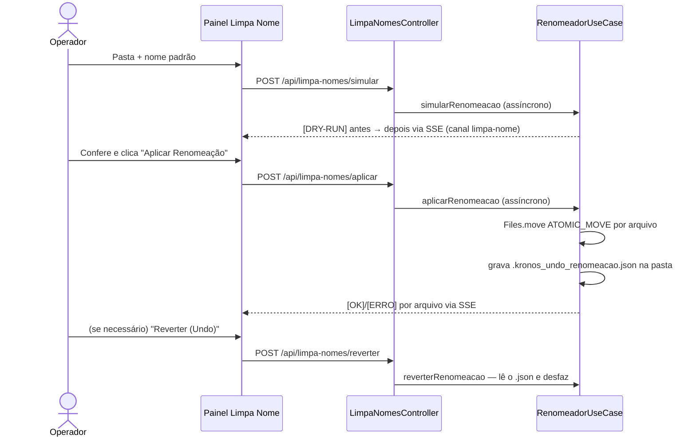

# 🧹 Módulo: Limpa Nome (Sanitizador de Nomes)

[← Troca Tipo Legenda](18-modulo-troca-tipo-legenda.md) | [Contextos & Lore →](09-contextos-lore.md)

---

## Para que serve

Painel **"10. Limpa Nome"** da SPA (grupo **Finalização**). Renomeia em lote arquivos de vídeo/legenda com nomes confusos de release groups de tracker (ex.: `[SubsPlease] Nome Anime - 01 (1080p) [ABCD1234].mkv`) para um padrão limpo `Nome do Anime - S01E01.mkv`, extraindo o número do episódio por **regex** — com simulação prévia (dry-run) e **reversão completa (undo)**.

---

## Pacote e classes principais

| Classe | Papel |
|--------|-------|
| `RenomeadorUseCase` (`application`) | Simula, aplica e reverte a renomeação; extrai o episódio por regex; salva o backup de reversão |
| `OperacaoRenomeacao` (`domain`) | Record da operação (id, data, pasta, lista de `ItemRenomeado` original → novo) |
| `LimpaNomesController` (`presentation/web`) | Endpoints REST (JAX-RS) — simular, aplicar e reverter em background |
| `LimpaNomesRequest` (`presentation/web`) | Record do payload `{caminhoOrigem, nomePadrao}` |

---

## Como o episódio é extraído

1. Tags entre colchetes (`[SubsPlease]`, `[ABCD1234]`) são removidas antes da análise.
2. **Padrão principal**: separadores comuns seguidos de número — `- 01`, `Ep 03`, `Episódio 03`, `E04`, `Episode 12`.
3. **Fallback**: primeiro número isolado de 2-4 dígitos no nome.
4. Sem número identificável → o arquivo é **mantido intacto** (nunca renomeia no chute).

O nome final é `"<Nome Novo Padrão> - S01E<NN><extensão original>"`.

---

## Fluxo com segurança de reversão



- **Dry-run primeiro, sempre**: a simulação lista cada `antes → depois` sem tocar em nada.
- **Undo garantido**: ao aplicar, um manifesto `.kronos_undo_renomeacao.json` é salvo na própria pasta; "Reverter" o lê e desfaz os `move` (o manifesto só é apagado se a reversão terminar sem erros).
- Conflitos (destino já existe) são **pulados com erro logado** — nunca sobrescreve.
- Cada arquivo renomeado incrementa a métrica `arquivosSanitizados` na [Telemetria](10-modulo-telemetria.md).

---

## Endpoints REST

| Endpoint | Payload | Canal SSE |
|----------|---------|-----------|
| `POST /api/limpa-nomes/simular` | `{caminhoOrigem, nomePadrao}` | `limpa-nome` |
| `POST /api/limpa-nomes/aplicar` | `{caminhoOrigem, nomePadrao}` | `limpa-nome` |
| `POST /api/limpa-nomes/reverter` | `{caminhoOrigem}` | `limpa-nome` |

```json
{ "caminhoOrigem": "C:/animes/[SubsPlease] Nome Anime", "nomePadrao": "Nome Anime" }
```

`caminhoOrigem` é **obrigatório** (`400` se ausente). Os três endpoints respondem `200` imediatamente e executam em background — acompanhe pelo console do painel.

---

## Pontos de atenção

- O padrão gerado assume **S01** fixo — para temporadas ≠ 1, inclua a temporada no nome padrão manualmente ou renomeie por temporada em pastas separadas.
- Renomear vídeos **depois** de traduzir/remuxar quebra o pareamento vídeo ↔ legenda do [Remuxer](08-modulo-remuxer.md) — o lugar natural do Limpa Nome é **antes** da Análise de Mídia ou **após o remux final**, na coleção pronta.
- O arquivo `.kronos_undo_renomeacao.json` fica na pasta alvo; não o apague antes de validar a renomeação.

---

## Navegação

| Anterior | Próximo |
|----------|---------|
| [← Troca Tipo Legenda](18-modulo-troca-tipo-legenda.md) | [Contextos & Lore →](09-contextos-lore.md) |
